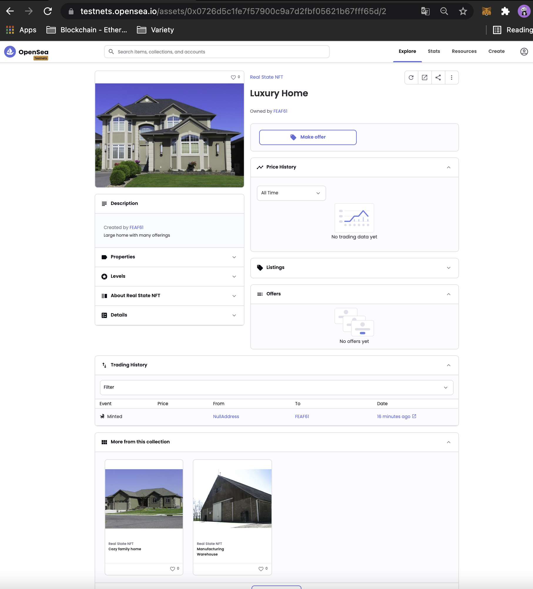

# Udacity Blockchain Capstone

Final project in order to end the Blockchain Developer Nanodegree Udacity on-line course.

## Introduction

This projects creates an NFT (Non-Fungible-Token) that represents properties in Real State. The idea is to incorporate a way to solve the validation problem on the property titles, saving money and time when a real state property is dealt.

The way to validate titles is done by Zocrates (zkSNARKS zero-knowledge Succinct Non-interactive ARgument of Knowledge), for details please click on: [Zocrates](https://zokrates.github.io/)

So, the holder of the title to validate, invokes a smart contract to validate his / her document without actually uncover it untill the property is sold. Once the document is validated by the zkSNARK algorithms, the titles is minted into the Real State network and publish to the [NFT market OpenSea](https://docs.opensea.io/)

## Checkout, test and feedback

**Remember the required software**

1. Nodejs
2. Ganache

Once you have checked out this project to your local computer, please follow these steps:

1. `npm install` in order to download all required dependencies (package.json for details).
2. `npm run zocrates` to compile, generate proofs (at least 3) to mint and the corresponding smart contract in solidity.
3. `truffle migrate --network ganache` to migrate and deploy smart contracts to ganache.
4. `truffle test --network ganache` to execute the tests developed for this project on ganache.
5. `truffle migrate --network rinkeby` to migrate and deploy smart contract to test network.

Once your smart contracts has been deployed, please navigate to:

- [Contract owner account](https://rinkeby.opensea.io/accounts/0xFEAf61c1814b9342C1533115523bB96458744fb7) to see on the test OpenSea network the contents for this account. 

- [Enumerate tokens](https://testnets.opensea.io/assets/0x0726d5C1fe7F57900C9a7D2fbF05621b67FFf65d/1) to see on the test OpenSea network the tokens minted in this smart contract. 

## Addresses

- **Owner account**: [0xFEAf61c1814b9342C1533115523bB96458744fb7](https://rinkeby.etherscan.io/address/0xfeaf61c1814b9342c1533115523bb96458744fb7)

- **Solution Smart Contract**: [0x0726d5C1fe7F57900C9a7D2fbF05621b67FFf65d](https://rinkeby.etherscan.io/address/0x0726d5C1fe7F57900C9a7D2fbF05621b67FFf65d)
At above link you can see the 6 transactions for Approve and Mint the 3 tokens. One more for the contract creation.

- **Verifier Smart Contract (generated by Zocrates)**: [0x91e929aBC05d7993FCc823246134d47390950Ec0](https://rinkeby.etherscan.io/address/0x91e929aBC05d7993FCc823246134d47390950Ec0)

### License of the project
SPDX-License-Identifier: MIT

### Contact
Luis Chapa: luis.chapa@hotmail.com